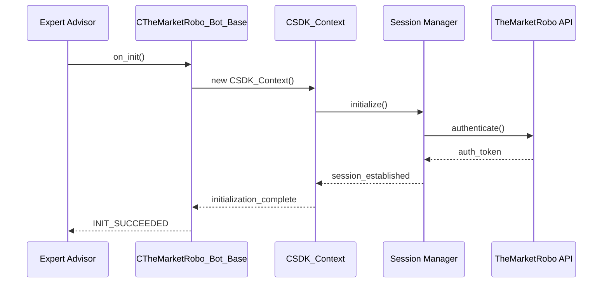
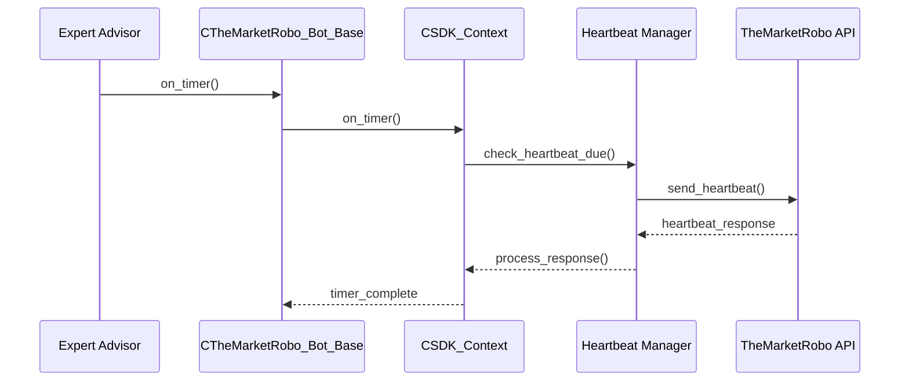
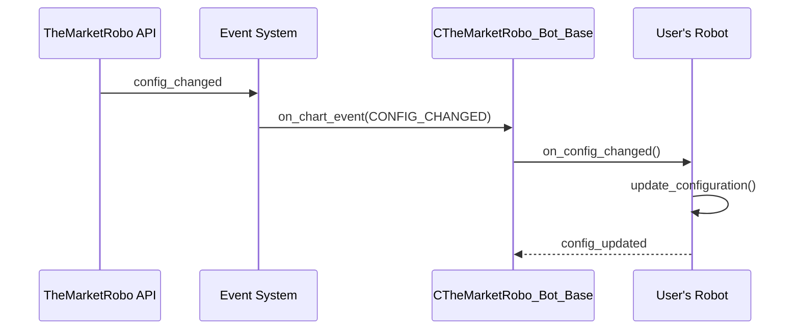
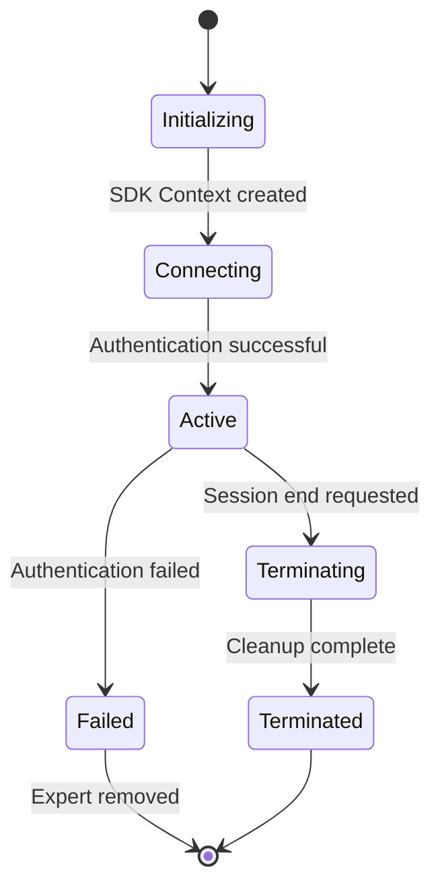
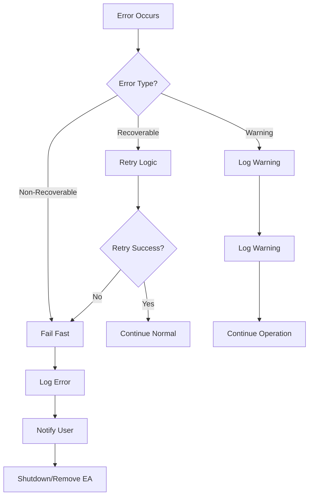

# SDK Architecture Overview

## Core Design Principles

TheMarketRobo SDK follows a modular, layered architecture designed for reliability, maintainability, and ease of use. The architecture emphasizes:

1. **Separation of Concerns** - Each component has a single responsibility
2. **Dependency Injection** - Loose coupling between components
3. **Event-Driven Communication** - Asynchronous event handling
4. **Fail-Safe Operation** - Graceful error handling and automatic recovery
5. **Security First** - Authentication and authorization at every level

## Architecture Layers

### 1. Presentation Layer (CTheMarketRobo_Bot_Base)

#### Purpose
Provides a clean, easy-to-use interface for developers while handling complex SDK operations behind the scenes.

#### Key Components
- **CTheMarketRobo_Bot_Base**: Abstract base class for all trading robots
- **Event Routing**: Translates MQL5 events to SDK events
- **Lifecycle Management**: Handles OnInit, OnDeinit, OnTimer, OnTick

#### Responsibilities
- Authentication and session management
- Event handling and routing
- Error handling and user notifications
- Resource cleanup

### 2. Application Layer (SDK Context)

#### Purpose
Orchestrates the interaction between different SDK components and manages the overall application state.

#### Key Components
- **CSDK_Context**: Main service container
- **Component Coordination**: Manages dependencies between services
- **State Management**: Tracks session and authentication state

#### Responsibilities
- Component initialization and wiring
- Session lifecycle management
- Cross-component communication
- Resource management

### 3. Domain Layer (Core Services)

#### Purpose
Contains the business logic and domain-specific functionality.

#### Key Components
- **Session Manager**: Authentication and session handling
- **Configuration Manager**: Real-time config updates
- **Symbol Manager**: Trading symbol management
- **Token Manager**: Authentication token lifecycle
- **Heartbeat Manager**: Connection health monitoring

#### Responsibilities
- Business rule enforcement
- Data validation and transformation
- Domain event generation
- State persistence

### 4. Infrastructure Layer (External Services)

#### Purpose
Handles external communications and data persistence.

#### Key Components
- **HTTP Service**: REST API communication
- **Data Collector**: System data gathering
- **Event System**: MQL5 chart event management

#### Responsibilities
- Network communication
- Data serialization/deserialization
- External API integration
- Error handling and retry logic

## Component Interaction Flow

### Initialization Sequence



### Runtime Operation Flow



### Configuration Update Flow



## Component Details

### CTheMarketRobo_Bot_Base

**Purpose:** Simplifies SDK integration by providing a clean inheritance-based interface.

**Key Features:**
- Automatic authentication handling
- Event routing and processing
- Error handling and user notifications
- Resource management

**Design Pattern:** Template Method Pattern
- Base class defines the algorithm structure
- Derived classes implement specific behaviors
- Common functionality is inherited

### CSDK_Context

**Purpose:** Service container that manages component dependencies and lifecycle.

**Key Features:**
- Dependency injection container
- Component initialization order management
- Resource cleanup coordination
- Cross-component communication

**Design Pattern:** Service Locator Pattern
- Centralized access to services
- Loose coupling between components
- Easy testing and mocking

### Session Manager

**Purpose:** Handles authentication and session lifecycle.

**Key Features:**
- API key validation
- Session establishment
- Token refresh automation
- Session termination handling

**State Machine:**


### Configuration Manager

**Purpose:** Manages real-time configuration updates from the server.

**Key Features:**
- JSON parsing and validation
- Field-level updates
- Change notification system
- Configuration persistence

**Data Flow:**
1. Server sends configuration update via webhook
2. HTTP Service receives and parses JSON
3. Configuration Manager validates changes
4. Event System notifies robot of changes
5. Robot applies new configuration

### Heartbeat Manager

**Purpose:** Maintains connection health and monitors system status.

**Key Features:**
- Periodic health checks
- Automatic reconnection
- System data collection
- Performance monitoring

**Heartbeat Payload:**
```json
{
  "timestamp": 1640995200,
  "account_balance": 10000.50,
  "open_positions": 5,
  "server_status": "connected",
  "memory_usage": 45.2
}
```

## Security Architecture

### Authentication Layers

1. **API Key Authentication**
   - Primary authentication mechanism
   - Server-side validation
   - Secure token generation

2. **Session Token Management**
   - Short-lived access tokens
   - Automatic refresh mechanism
   - Secure storage in memory

3. **Request Signing**
   - HMAC-SHA256 signature verification
   - Timestamp validation
   - Replay attack prevention

### Security Controls

- **Input Validation**: All inputs validated before processing
- **Error Handling**: Secure error messages (no sensitive data leakage)
- **Memory Security**: Sensitive data cleared from memory
- **Network Security**: HTTPS-only communication
- **Rate Limiting**: Built-in request throttling

## Error Handling Strategy

### Error Classification

1. **Recoverable Errors**
   - Network timeouts
   - Temporary server issues
   - Automatic retry with backoff

2. **Non-Recoverable Errors**
   - Invalid API key
   - Configuration errors
   - Expert Advisor removal

3. **Warning Conditions**
   - High latency
   - Memory usage warnings
   - Configuration validation warnings

### Error Propagation



## Performance Considerations

### Optimization Strategies

1. **Memory Management**
   - Object pooling for frequently used objects
   - Automatic cleanup of unused resources
   - Memory usage monitoring

2. **Network Efficiency**
   - Connection pooling
   - Request batching
   - Compression for large payloads

3. **CPU Optimization**
   - Asynchronous processing
   - Efficient data structures
   - Algorithm optimization

### Performance Metrics

- **Initialization Time**: < 2 seconds
- **Memory Footprint**: < 50MB
- **Network Usage**: < 1MB/hour (normal operation)
- **CPU Usage**: < 5% average

## Testing Strategy

### Unit Testing

- Individual component testing
- Mock external dependencies
- Automated test suites

### Integration Testing

- End-to-end workflow testing
- API integration testing
- Performance testing

### Manual Testing

- User acceptance testing
- Edge case validation
- Cross-platform compatibility

## Deployment and Distribution

### File Structure

```
Include/TheMarketRobo/SDK/
├── TheMarketRobo_SDK.mqh      # Main include
├── CTheMarketRobo_Bot_Base.mqh # Base class
├── docs/                      # Documentation
├── Interfaces/               # Abstract interfaces
├── Core/                    # Core components
├── Services/               # External services
├── Utils/                  # Utility classes
└── Models/                 # Data models
```

### Version Management

- Semantic versioning (MAJOR.MINOR.PATCH)
- Backward compatibility maintenance
- Deprecation warnings for breaking changes

### Distribution Channels

- Direct file distribution
- Automated update system
- Documentation synchronization

## Future Enhancements

### Planned Features

1. **Plugin Architecture**
   - Extensible component system
   - Third-party integrations
   - Custom indicators support

2. **Advanced Analytics**
   - Performance metrics collection
   - Trading strategy analysis
   - Risk assessment tools

3. **Multi-Asset Support**
   - Cross-symbol trading
   - Portfolio management
   - Asset correlation analysis

### Scalability Improvements

1. **Microservices Architecture**
   - Component decoupling
   - Independent deployment
   - Horizontal scaling

2. **Caching Layer**
   - Configuration caching
   - API response caching
   - Performance optimization

This architecture provides a solid foundation for building reliable, secure, and maintainable trading robots using TheMarketRobo SDK.
